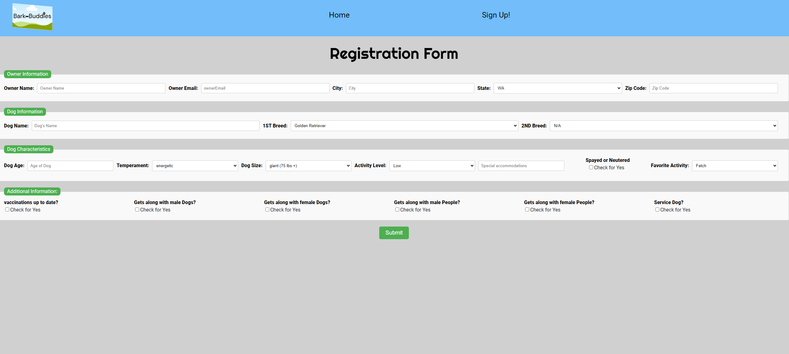

# portfolio-prep

## Author

Kaitlin Davis || 26 November 2023

## About Me

### Title

Software Apprentice

### Headline

Aspiring Software Developer

### Profesional Pitch

 Before making the leap into the world of software development, I had a solid foundation in the life sciences. I earned my degree in biology and gained valuable experience working in the bio-pharmaceutical industry for nearly a year. While I found my work in that field rewarding, I couldn't ignore the growing fascination I had for technology and its transformative potential.

That's why I decided to pivot my career towards software development. The decision was driven by my passion for problem-solving and my eagerness to be part of an industry that constantly pushes the boundaries of innovation. I chose software development because it allows me to combine my scientific background with coding skills to build solutions that have a real impact on people's lives.

### Why Tech:

Tech is a forever growing industry. It is an opportunity to make a difference in our everyday lives.

## Images

### Headshot

### Background Image

### Project Images

### Other Images

